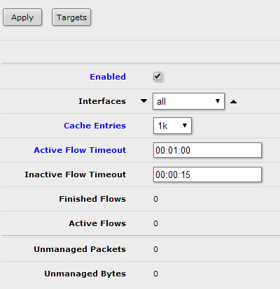
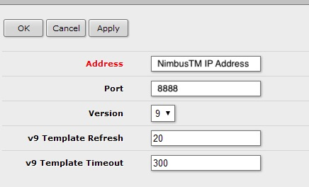

# Example Device configurations for flow exports to NimbusTM


This page provides sample configurations to send data to NimbusTM. The default port NimbusTM accepts metadata on is UDP 8888,  partners can request a different ports or multiple ports if desired. The IP address of your NimbusTM instance is provied as part of the initial set up process.

Once flow exports are configured partners may access the user interface to view pre-built dashboards and reports.

***
## ! ! W A R N I N G ! !

Althought we try to keep these guides as up to date and accurate as possible, they are guides. These samples may need to be modified, it is not wise to simply cut and paste without a thorough understanding of each command.
***

## Common Commands 

Although many vendors may differ slightly in how they implement flow technologies, there are some commands that are common enough it makes sense to define them globably. Please note the exact spelling of these commands may vary between vendors. 


### Flow Template ###
Some flow varients (E.G IPFIX, Flexible Netflow) allow the user to customize what elements are sent to the flow collector. Some vendors offer default templates, some require they be configured manually. Once configured templates are sent to the flow collectors intermittently to define what elements will be sent in the flow records. 

### Active Timeout ###
How long before statistics for a flow will stop being recorded and sent to collector. Default values for this vary widley accross vendors, platforms, versions. We reccomend this value be set to 60 seconds

### Inactive Timeout ###
Flows that are inactive for this period of time will be exported from the flow cache. We reccomend 15 seconds.

### Template Timeout ###
Specifies how frequently a flow template will be exported to a collector. We reccomend 60 seconds. 

### Export Destination 
Specifies the IP Address of the flow collector (E.G NimbuTM)

### Export Source 
Specifies the Interface that the netflow packets will leave the device from in order to get to the flow collector

### Export Transport Port 
For the most part Netflow is transmitted via UDP, for NimbusTM the default port is 8888, others can be configured as desired. 


***

## Router Guides

* [Cisco](###Cisco-Devices)
    * [IOS-XR](###IOS-XR)
* [Huawei](###Huawei)
* [Juniper](#Juniper-Devices)
    * [Juniper IPFIX](#Juniper-IPFIX-Configuration)

* [MikroTik Routers](#MikroTik-Routers)
    * [Command Line](#MikroTik-CLI-Configuration)
    * [Graphical User Interface](#MikroTik-GUI-Configuration)


***

# Cisco Devices

# IOS-XR

## Supported Devices 

* NCS-550X

* ASR 9K

This list of Feature Updates is taken from <a href="https://www.cisco.com/c/en/us/td/docs/routers/asr9000/software/asr9k-r6-4/netflow/configuration/guide/b-netflow-cg-asr9k-64x/b-netflow-cg-asr9k-64x_chapter_010.html">Cisco's Public Documentation</a>

> Release 3.9.1 This feature was introduced. <br>
> Release 4.0.0 IPv6 Sampled NetFlow feature was introduced.<br>
> Release 4.2.0 Destination-based Netflow Accounting feature was introduced.<br>
> Release 5.2.0 The VRF table was added: Options Template Overview<br>
> Release 6.0.1 Flow Filter and IPFIX features were introduced.<br>
> Release 6.1.2 Enhancement to the Netflow Records to Capture BGP IPv6 Next-hop feature was introduced.<br>

***

## Directory Structure

Cisco offers both Netflow v9 and IPFIX as a transport mechnism for flow export. There are three directories which are edited in order to enable these features. 

```javascript

// Used to define collector IP, transport port, source interface, and flow version.

router(config)# flow exporter-map Exporter 

// Specifies the rate at which packets (one out of n packets) are sampled.

router(config)# sampler-map Sampler

// Binds together the sample-map and exporter-map and gets applied to interfaces 

router(config)# flow monitor-map Monitor

```

***

## Configuration Guide

### Step 1: Configure the Exporter Map 


```
router# config t
router(config)# flow exporter-map NimbusTM
router(config-fem)# destination <NimbutTM_IP_Address>
router(config-fem)# source <interface_name>
router(config-fem)# transport udp 8888
router(config-fem-ver)# version v9
router(config-fem-ver)# options sampler-table timeout 60
router(config-fem-ver)# template data timeout 60

```

### Step 2: Configure the Sample Map 

```
router# config t
router(config)# sampler-map NimbusSampler
router(config-sm)# random 1 out-of <sample_rate> (E.G 2048)
router(config)# end

```

### Step 3: Congfigure the Monitor Maps 

```
# Configure v4 Monitor Map

router# config t
router(config)# flow monitor-map NimbusMonitorV4
router(config-fmm)# record ipv4
router(config-fmm)# cache timeout inactive 15
router(config-fmm)# cache timeout active 60
router(config-fmm)# exporter NimbusTM
router(config-fmm)# exit

# configure v6 monitor-map 

router(config)# flow monitor-map NimbusMonitorV6
router(config-fmm)# record ipv6
router(config-fmm)# cache timeout inactive 15
router(config-fmm)# cache timeout active 60
router(config-fmm)# exporter NimbusTM

```

### Step 4: Apply Monitor Map and Sampler Map to Interfaces

```
router# config t
router(config)# interface <Interface_Name>
router(config-if)# flow ipv4 monitor NimbusMonitorV4 sampler NimbusSampler ingress
router(config-if)# flow ipv6 monitor NimbusMonitorV6 sampler NimbusSampler ingress

```
#### Verification (Optional)

```

 show flow monitor

 show flow exporter-map NimbusTM

```

# Huawei

## Supported Devices 

Most Huawei devices provide support for Netstream, instead of composing a list of each model it is reccomended to search for you model directly to verify support for the technology. Here is a useful link for CE devices: <a href="https://support.huawei.com/enterprise/en/doc/EDOC1000060766/a4d5e426/which-ce-switches-suppoNE40ENE20ENE80ECE12800rt-netstream">Cloud Engine Netstream Support</a>

* Various NE models
* Various CE models

## Directory Structure

## Configuration Guide

### Step 1 

Configure global commands for the netstream process Interface_IP and NimbutTM_IP_Address are examples used in this configuration. The Interface IP needs to be modified to be the IP Address of the interface that will export the flow data, NimbutTM_IP_Address must be modified to that of your NimbusTM instance. 

Configure timeouts and Flow Version 
```

ip netstream timeout active 1
ip netstream timeout inactive 15
ip netstream export version 9
ip netstream export source <Interface_IP>
ip netstream export host  <NimbutTM_IP_Address> 8888

```

### Step 2 
```

# this command is only necessary if you run VRP >= 5.0
# it will store interface indices in 32bit counters (as SNMP does) instead of 16bit.
ip netstream export index-switch 32

ip netstream export template timeout-rate 1
ip netstream sampler fix-packets {{device_sample_rate}} inbound
ip netstream export source {{device_sending_ip}}
# Ship flow records to KProxy
# default KProxy port for flow records ingest is 9995
# update the next line with another port if your KProxy instance uses a custom-set port
ip netstream export host {{kentik_flow_proxy_IP}} 9995

```

***


# Juniper Devices 


# Juniper IPFIX Configuration


## Supported Devices 

This list of supported devices is taken from <a href="https://www.juniper.net/documentation/en_US/junos/topics/task/configuration/services-ipfix-flow-template-flow-aggregation-configuring.html">Junipers public documentation</a> 

>Starting with Junos OS Release 17.3R1, IPFIX flow templates are supported on QFX10002 switches.<br>
Starting with Junos OS Release 17.4R1, IPFIX flow templates are supported on QFX10008 and QFX10016 switches.<br>
Starting with Junos OS Release 19.4R1, IPFIX flow templates are supported on SRX4100, SRX4200, SRX4600, SRX5400, SRX5600, SRX5800, vSRX, and vSRX3.0 devices.<br>
Starting with Junos OS Release 20.1R1, IPFIX flow templates are supported on SRX300, SRX320, SRX340, SRX345, and SRX550HM devices.<br>
Starting with Junos OS Release 20.4R1, IPFIX flow templates are supported on NFX150, NFX250 NextGen, and NFX350 devices.

***
## Directory Structure
Juniper offers IPFIX as a transport mechnism for flow export. There are three hierarchy levels that are edited in order to enable the IPFIX exports here is a brief description of what is accomplished at each level: 

```python

[edit chassis] # Associates the sampling instance with the FPC 

[edit services flow-monitoring] # Configure the flow template properties

[edit forwarding-options] # Bind flow template to sampling instance and define collector properties
```

***


## Configuration Guide

### Step 1 : Associate Sampling Instance with the FPC


```python 

#names the sampling instance 'NFSAMPLING'

set chassis fpc 0 sampling-instance NFSAMPLING 

#configures the maximum table size in units of 256k entried. We reccomend 8 for IPv4 and 7 for IPv6.

edit chassis fpc 0 inline-services flow-table-size
set ipv4-flow-table-size 8
set ipv6-flow-table-size 7
```

### Step 2 : Define Flow Template Properties

Juniper allows for both IPv4 and IPv6 traffic monitoring, each requires a seperate [Flow Template](##Flow-Template) 


```python 
# Configures the IPv4 Flow Template

set services flow-monitoring version-ipfix template NFSAMPLING ipv4-template 
set services flow-monitoring version-ipfix template NFSAMPLING template-refresh-rate second 60
set services flow-monitoring version-ipfix template NFSAMPLING template-refresh-rate packets 30
set services flow-monitoring version-ipfix template NFSAMPLING flow-active-timeout 60
set services flow-monitoring version-ipfix template NFSAMPLING flow-active-timeout 15

# Configurares the IPv6 Template 

set services flow-monitoring version-ipfix template NFSAMPLING-v6 ipv6-template 
set services flow-monitoring version-ipfix template NFSAMPLING-v6 template-refresh-rate second 60
set services flow-monitoring version-ipfix template NFSAMPLING-v6 template-refresh-rate packets 30
set services flow-monitoring version-ipfix template NFSAMPLING-v6 flow-active-timeout 60
set services flow-monitoring version-ipfix template NFSAMPLING-v6 flow-active-timeout 15


```

### Step 3 : Associate Templates with Sampling Instance and Define Collector Properties

> The flow-server address of <NimbutTM-IP-Address> and source-address of <interface-ip-address> are examples used in this config. You will need to modify the flow-server address to the IP Address of your NimbusTM,the source-address must match the IP of the Juniper interface you want to send flow data from. 


```python 

#moves into hierarchy needed to configure collector details and associate the IPv4 template.

edit forwarding-options sampling instance NFSAMPLING family inet output
set flow-server <NimbutTM-IP-Address>
set flow-server <NimbutTM-IP-Address> port 8888
set flow-server autonomous-system-type origin
set flow-server <NimbutTM-IP-Address> version-ipfix template NFSAMPLING
set forwarding-options sampling instance NFSAMPLING inline family inet output inline-jflow source-address <interface-ip-address>

#moves into hierarchy needed to configure collector details and associate template the IPv6 template.

edit forwarding-options sampling instance NFSAMPLING family inet6 output
set flow-server <NimbutTM-IP-Address>
set flow-server <NimbutTM-IP-Address> port 8888
set flow-server autonomous-system-type origin
set flow-server <NimbutTM-IP-Address> version-ipfix template NFSAMPLING
set forwarding-options sampling instance NFSAMPLING inline family inet6 output inline-jflow source-address <interface-ip-address>
```
### Step 4  : Indicate which interface to monitor. 

After IPFIX set up is completed, enable the monitoring for specific interfaces on the Juniper device. 
> interface-name-1 and interface-name-2 are example interface names and will need to be modified to match the names of interfaces you would like to monitor.

```python
#enables ipv6 and ipv4 flow monitoring for 2 interfaces. 

set interfaces interface-name-1 unit 0  family inet sampling input
set interfaces interface-name-1 unit 0  family inet6 sampling input
set interfaces interface-name-2 unit 0  family inet sampling input
set interfaces interface-name-2 unit 0  family inet6 sampling input

```
### Verification (Optional)

Juniper offers a show services accounting flow command that can be used to verify traffic is being sent, if you run this command a few times you can verify that the flow bytes value is incrementing, which indicates flows are being sent. 


```
#issue command 
user@MX480–router> show services accounting flow

Flow information
    Interface name: sp-2/0/0, Local interface index: 152
    Flow packets: 884, Flow bytes: 56576 # <-- Note Value
    Flow packets 10-second rate: 0, Flow bytes 10-second rate: 628
    Active flows: 10, Total flows: 35
    Flows exported: 75, Flows packets exported: 14
    Flows inactive timed out: 25, Flows active timed out: 75

#issue command again
user@MX480–router> show services accounting flow

Flow information
    Interface name: sp-2/0/0, Local interface index: 152
    Flow packets: 884, Flow bytes: 57421 # <-- Verify Value Increments
    Flow packets 10-second rate: 0, Flow bytes 10-second rate: 628
    Active flows: 10, Total flows: 35
    Flows exported: 75, Flows packets exported: 14
    Flows inactive timed out: 25, Flows active timed out: 75


```

# MikroTik-Routers

MicroTik Netflow configuration can be configured either via the command line or through there GUI, both guides are provided below. 


# MikroTik CLI Configuration

## Directory Structure
The MikroTik command line provides two sub-menus that are used to configure Netflow exports. These sub-menus are :

```python      

/ip traffic-flow   # used to enable flow monitoring. 
/ip traffic-flow target # used to define collector properties and flow version. 

```
***

## Supported Devices
This list of supported devices is taken from <a href= "https://wiki.mikrotik.com/wiki/Manual:IP/Traffic_Flow">Mikrotiks public documentation</a>

>RouterOS 2.9, v3, v4 +

***


## Configuration Guide

### Step 1: Enable Flow Monitoring and Select Interfaces to Monitor

Choose which interfaces to monitor traffic on. MikroTik allows users to select a single interface, combination of interfaces using a comma to seperate each, or all interfaces by ommiting the interface arugment entrely. 

>ether1 and ether2 are sample interface names and may need to be modified depending on your router

```python 
# enable monitoring for a single interface.

/ip traffic-flow set enabled=yes interfaces=ether1 active-flow-timeout=1m


# enable monitoring for multiple interfaces using comma delimitation 

/ip traffic-flow set enabled=yes interfaces=ether1:ether2 active-flow-timeout=1m

# omit the interface key to enable monitoring for all interfaces. 

/ip traffic-flow set enabled=yes active-flow-timeout=1m

```

### Step 2: Define Flow Version and Collector Properties.


><NimbutTM-IP-Address>  is an example address and will need to be modified to match the IP address of your NimbusTM instance. 

```python

/ip traffic-flow target add dst-address=<NimbutTM-IP-Address> port=8888 version=9

```

After issuing this command, your router will now be sending flow data to NimbusTM.

### Verification (Optional)

MikroTik provides a **print** function that can be used to verfy the above commands were applied as intended. You can issue this in for each sub-menu with the following commands. 


```

/ip traffic-flow print

/ip traffic-flow target print

```

# MikroTik GUI Configuration

### Step 1: From the Main Menu navigate to IP -> Traffic Flow 

From within these settings select your desired options. Similar to the CLI configuration you can specify some combination of interfaces or all interfaces. One settings are coinfigured click 'Apply'




### Step 2 Navigate to Targets 

Populate the Address box with the 'Address' section with the IP Address of NimbusTM, the rest of the options can be set to match the image below. After all sections are filled out click 'Apply' and flows will be sent to your NimbusTM instance.



***


***

## Questions, Comments, Suggestions
Feedback is both welcome and encouraged! Please send any correspondence to
        [outreach@cymru.com](mailto:outreach@cymru.com) 

